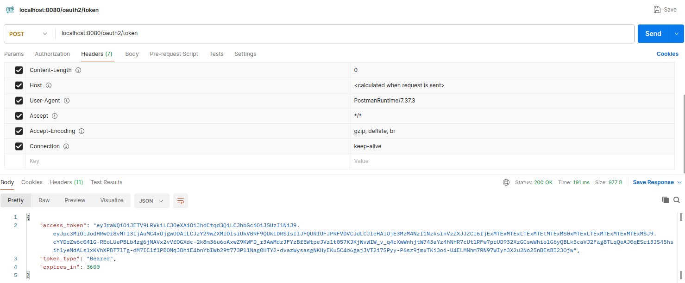
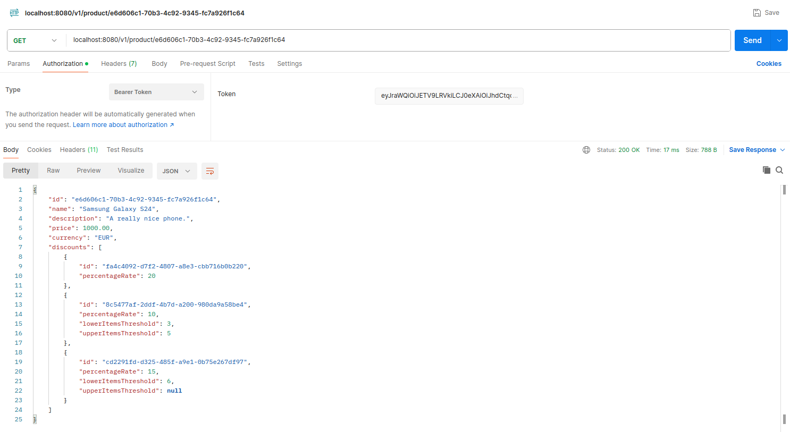
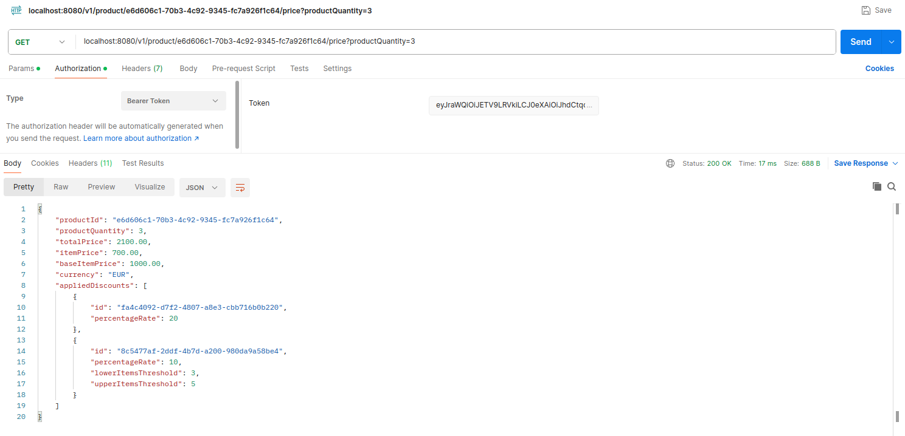

# discount-management

## Description

A component of a shopping platform that calculates product prices based on configurable discount policies.
Each product in the system is uniquely identified by a UUID. Discounts can be applied in two ways:
1. Quantity-Based Discounts: Discounts that increase as the quantity of items ordered
   increases.
2. Percentage-Based Discounts: A fixed percentage discount applied to the total price.

## Getting Started

These instructions will get you a copy of the project up and running on your local machine for development and testing purposes.

### Prerequisites

To properly build an application one might need to install [Java 17](https://www.oracle.com/th/java/technologies/downloads/#java17) and/or [Docker](https://www.docker.com/get-started).

### Cloning

```
$ git clone https://github.com/ninjarlz/discount-management
```

### Building

Using the installation of Java 17 and built-in gradle wrapper:
```
$ ./gradlew build
```

### Running application

One can build & run application using the provided [Dockerfile](Dockerfile) and [docker-compose.yml](docker-compose.yml) files.
Docker compose file contains a definition of the containerized instance of the PostgreSQL database.
To run the application in the `dev` profile containing configuration for communication with the containerized database, one has to 
execute the following command (please, make sure that there is an available Docker daemon instance running on your local
machine):
```
$ ./docker compose up
```

To rebuild an application image, once something was modified, one can use the following set of commands:
```
$ ./docker compose down
$ ./docker compose build web
$ ./docker compose up
```

### Authentication

To access any of the application endpoints, one has to fetch the JWT authorization token and attach it to the request using
`Authorization` header with `Bearer <token_value>` value.

Application in `dev` profile (that can be run via [docker-compose.yml](docker-compose.yml) file) exposes mock authorization server
with the following endpoint:

`POST localhost:8080/oauth2/token`



The given endpoint does not require any kind of body or other type of credentials and returns a token with all
permissions required by the application API.

The decoded token payload has the following structure:

```
{
  "iss": "http://127.0.0.1:8080",
  "scopes": [
    "READ_PRICE",
    "READ_PRODUCT"
  ],
  "exp": 1733873041,
  "userId": "11111111-1111-1111-1111-111111111111"
}
```

The configuration provided in the `dev` profile makes the token valid for an hour, however, the set of authorization keys is
generated during application startup, so please note that tokens cannot be reused across different runs of the application.
The behaviour of the mock authorization server can be adjusted via properties described [in this section](#authentication-1).

### Running tests

To run a set of provided unit test scenarios, one has to execute the following command:
```
$ ./gradlew test
```

To run a set of provided integration test scenarios using Spring `MockMvc` and Testcontainers instance of PostgreSQL database,
one has to execute the following command (please, make sure that there is an available Docker daemon instance running on your
local machine):
```
$ ./gradlew integrationTest
```

## Configuration

### Liquibase and test data

Database schema is defined in the [liquibase script](src/main/resources/database/schema/master.xml). Apart from the database
structure, it provides a set of exemplary data meant to be used for testing purposes. To change the discounts configuration, one
can manually modify the following changeset - [exemplary_data.xml](src/main/resources/database/schema/changesets/1_0/exemplary_data.xml).
Please, note that in such case, one should rebuild the application and recreate the containerized database instance via the following commands:
```
$ ./docker compose down
$ ./docker compose build web
$ ./docker compose up
```
Otherwise, the given changelog will be not executed on the database, resulting in changelog checksum conflict and application crash.

Another possibility is to add a new liquibase changeset with data insertion/update. In such case the solution will still properly
operate without a need for database recreation, but the application container should be rebuilt.

The last option is to directly connect to the running database instance and manually insert/update a given set of data using the following properties
defined in the `dev` profile:
```
spring:
  datasource:
    url: jdbc:postgresql://db:5432/discount-management
    username: postgres
    password: postgres
```

### Authentication

Contains configuration for `dev` profile that exposes mocked OAuth2 JWT token endpoints. 
The behaviour of the mocked authorization server can be configured via the following set of properties: 
```
dev-mode:
  mock-auth-enabled: true
  mock-auth-token-timeout-in-seconds: 3600
  mock-auth-user-id: 11111111-1111-1111-1111-111111111111
```

## Implementation

### Getting product details

Return product details for a given product identifier. The product identifier in the URL has the form of UUID.

To fetch the product details, one has to access the following endpoint:

`GET localhost:8080/v1/product/e6d606c1-70b3-4c92-9345-fc7a926f1c64`



The endpoint requires a valid JWT token with `READ_PRODUCT` scope - check [here](#authentication) how to get the token.

API behaviour:
* Product identifier in the URL must have the form of UUID (the `400` response is returned for invalid identifiers).
* When there is no product with the given identifier, the `404` response is returned.

### Calculating product price

Calculates a price for a given product identifier and product quantity. Applies all associated percentage-based 
discounts and quantity-based discounts. A product can be assigned to only one percentage-based discount and multiple 
quantity-based discounts. Price can be decreased by applying one percentage-based discount and one quantity-based discount. 
In case both types of discounts are assigned to the given product and quantity, their rates are summed up.
In case of multiple associated quantity-based discounts with overlapping quantity thresholds, the one with a higher discount rate 
is applied.

To calculate the price, one has to access the following endpoint:

`GET localhost:8080/v1/product/e6d606c1-70b3-4c92-9345-fc7a926f1c64/price?productQuantity=3`



The endpoint requires a valid JWT token with `READ_PRICE` scope - check [here](#authentication) how to get the token.

API behaviour:
* Product identifier in the URL must have the form of UUID (the `400` response is returned for invalid identifiers).
* When there is no product with the given identifier, the `404` response is returned.
* Product quantity cannot be less than 1, otherwise, the `400` response is returned.

### Modifying set of data

Check [this section](#liquibase-and-test-data) to know how to configure application data.

## Built with

* [Spring Boot](https://spring.io/projects/spring-boot) - the world’s leading Java web app creation platform.
* [Liquibase](https://docs.liquibase.com) - an open-source database schema change management tool that tracks, 
manages, and applies database changes (like version control for databases) across various environments using scripts called "changelogs".
* [Hibernate](https://hibernate.org/orm) - an open-source Object-Relational Mapping (ORM) framework for Java that simplifies database interactions
by mapping Java objects to database tables and handling data persistence.
* [PostgreSQL](https://www.postgresql.org) - an open-source, advanced relational database management system (RDBMS) known for its robustness, extensibility, and support for both SQL and JSON querying.
* [MapStruct](https://mapstruct.org) - a code generator that greatly simplifies the implementation of mappings between Java bean types based on a convention over configuration approach.
* [Logbook](https://github.com/zalando/logbook) - an extensible Java library to enable complete request and response logging for different client- and server-side technologies.
* [Apache Commons](https://commons.apache.org) - a collection of reusable, open-source Java libraries and components that provide a wide range of utilities to simplify common programming tasks, 
such as file handling, string manipulation, and configuration management.
* [Docker](https://www.docker.com/get-started) - an open-source platform that automates the deployment, scaling, and management of applications using lightweight, 
portable containers that include everything needed to run the software.

## Developers

* **Michał Kuśmidrowicz** - [ninjarlz](https://github.com/ninjarlz)

## License

This project is licensed under the MIT License - see the [LICENSE](LICENSE) file for details.
